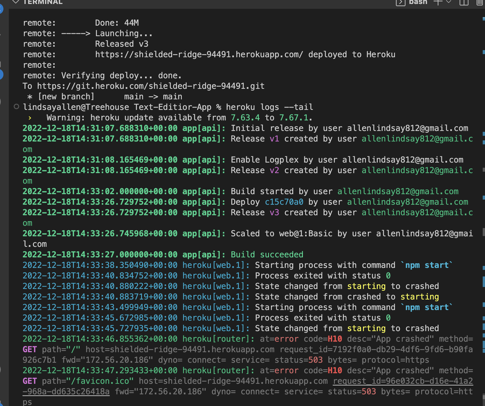
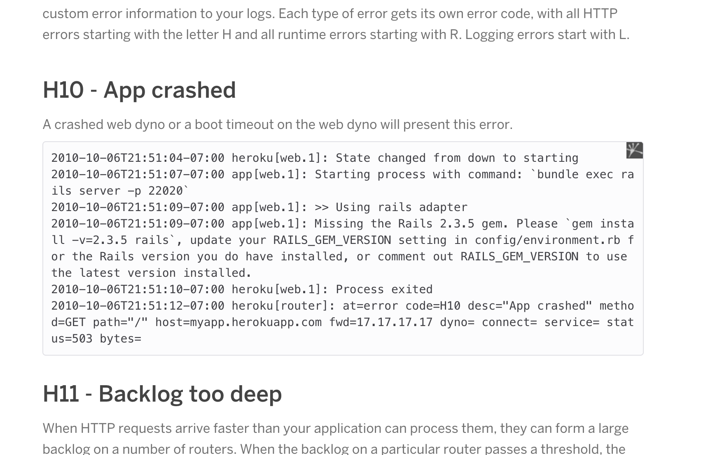

# Text Editor APP

*****
  

## Description
A PWA that works to save code snippets on and off line using webpack helpers
## Table of Contents
- [Description](#description)
- [Installation](#installation)
- [Usage](#usage)
- [License](#license)
- [Contributing](#contributing)
- [Tests](#tests)
- [Questions](#questions)
- [Sources](#sources)

*****

## Installation
Installing at this time is unavailable. I attempted to deploy with Heroku in two different ways, command line and through the Heroku dashboard without success. 

*****
## Usage
This app will function both online and offline to save code snippets.
[repo](https://github.com/katsaymeow/Text-Editor-App)

*****
## License

[Open](https://wiki.creativecommons.org/wiki/Open_license#:~:text=An%20open%20license%20or%20free,use%20it%20how%20you%20want%22.)

This application is covered by the Open license. 
*****
## Contributing
Lindsay Allen
*****
## Tests
N/A
*****
## Questions
Please create a pull request with any issues
*****
## Sources
[webpack dev support](https://developer.chrome.com/docs/workbox/modules/workbox-recipes/)

[Heroku dev center](https://devcenter.heroku.com/articles/error-codes#h10-app-crashed)

*****

Find me on GitHub: [katsaymeow](https://github.com/katsaymeow)

Email me with any questions: allenlindsay812@gmail.com

    